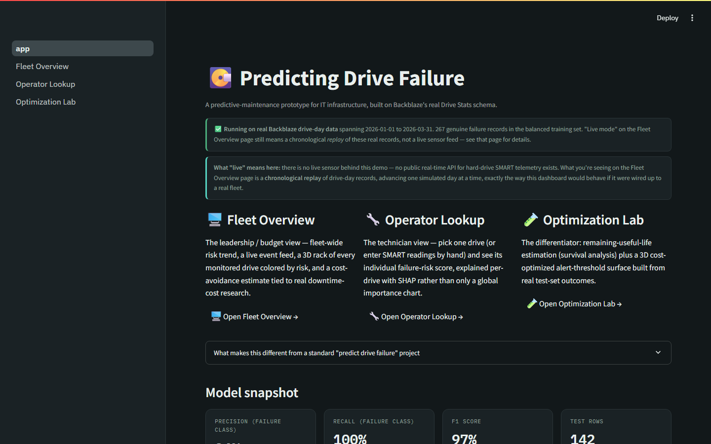
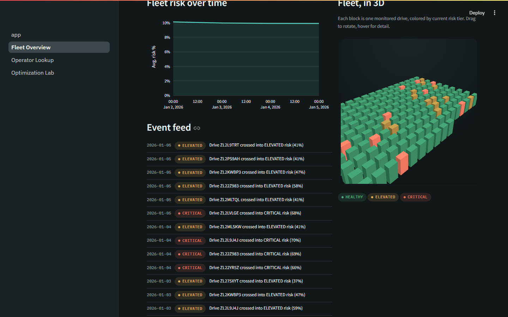
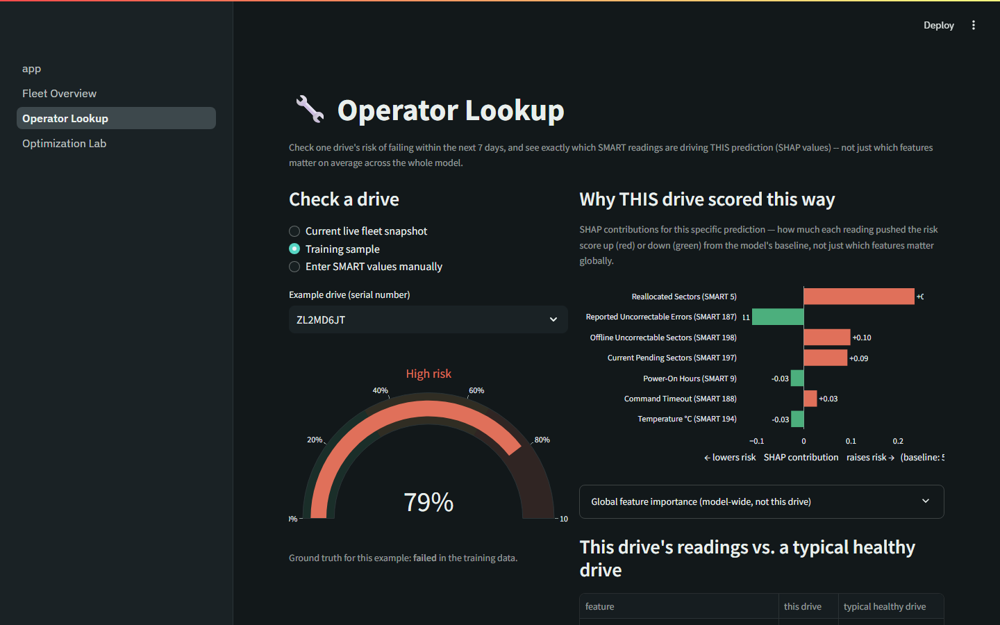
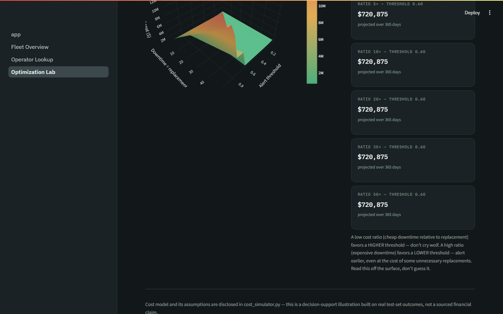

# Predicting Drive Failure

[](https://hdd-failure-predictor.onrender.com)
[](https://www.python.org/)
[](https://streamlit.io/)
[](LICENSE)

**Live demo:** https://hdd-failure-predictor.onrender.com *(Render free tier — spins down after 15 min idle, ~1 min to wake back up on first load)*

A predictive-maintenance prototype: trains models on hard-drive SMART
telemetry (Backblaze's real published schema) to flag drives likely to fail,
estimate how long they have left, and recommend a cost-optimal alert
threshold — served through **three Streamlit dashboards** in one deployment.
Built for an IT capstone project, deployable for free.

- **Fleet Overview** (`pages/1_Fleet_Overview.py`) — the leadership/budget
  view: a "live-feel" chronological replay of the fleet, a 3D rack of every
  monitored drive colored by risk, an event feed, a fleet-risk trend chart,
  and an adjustable cost-avoidance estimate.
- **Operator Lookup** (`pages/2_Operator_Lookup.py`) — the technician view:
  pick one drive and see its individual risk score, explained with **SHAP**
  values specific to that drive, not just a model-wide importance chart.
- **Optimization Lab** (`pages/3_Optimization_Lab.py`) — the differentiator:
  a **remaining-useful-life** estimate per drive (survival analysis via a Cox
  Proportional Hazards model), and a **3D cost-optimized alert-threshold
  surface** built from real held-out test predictions.

## Screenshots

| Home — real-data banner | Fleet Overview — 3D rack + event feed |
|---|---|
|  |  |

| Operator Lookup — per-drive SHAP | Optimization Lab — RUL + 3D cost surface |
|---|---|
|  |  |

## Why this project isn't just another "predict drive failure" notebook

Backblaze's dataset is one of the most common public ML case studies there
is — plenty of prior student and public projects use it for plain binary
classification. Four things make this one substantively different, not just
visually different:

1. **Early-warning labeling, not same-day diagnosis.** The classifier
   predicts failure within the next `HORIZON_DAYS` (7, in `prepare_data.py`)
   from *prior* readings. The day a drive actually fails is excluded from
   training — using it would just be recognizing an already-failed drive,
   which is trivial and not predictive of anything. A lot of hobby projects
   on this dataset make exactly that same-day-leakage mistake without
   realizing it.
2. **Remaining useful life, not just yes/no.** `scripts/train_survival_model.py`
   fits a Cox Proportional Hazards model (via `lifelines`) so a drive gets an
   estimated number of days left, not just a risk label — the standard
   framing in real industrial predictive maintenance.
3. **Per-prediction explainability.** SHAP (`shap` library) explains *this
   specific drive's* score on Operator Lookup, not just which features
   matter on average.
4. **A genuine decision-support result, not just a risk score.** The cost
   surface on Optimization Lab shows that the *right* alert threshold
   depends on an organization's own cost structure — there's no single
   universal answer, which is the actually useful, non-obvious finding.

## ⚠️ What "live" means here — read this before you demo it

There is no live sensor behind this dashboard, and no public real-time API
for hard-drive SMART telemetry exists. The Fleet Overview page instead
**replays real-schema drive-day records in chronological order**, one
simulated day per tick — exactly how this dashboard would behave if it were
wired up to real servers, just without a real server behind it. This is a
standard way monitoring-tool demos work; the dishonest version would be
*not* labeling it as a replay, which is why the dashboard itself says so
in a banner. Turning on "Live mode" auto-advances the clock; "Step forward"
advances it manually; "Restart simulation" resets the running counters.

This mechanism works identically on real downloaded Backblaze data — see
below — the only thing that changes is the authenticity of what's being
replayed.

## ⚠️ About the bundled sample data — read this first

This repo ships with `data/sample_drive_stats.csv`, a **simulated** dataset,
not real Backblaze telemetry. It was generated in a sandboxed build
environment that could not reach Backblaze's file host to download the real
~1–1.3 GB quarterly dataset. The simulator (`scripts/generate_sample_data.py`)
uses:

- the **real column names** from Backblaze's published Drive Stats schema
- the **real 2025 annualized failure rate** (1.36%, down from 1.55% in 2024 —
  Backblaze, 2026) for reporting purposes
- a **deliberately oversampled** failure rate (10%, vs. the true 1.36%) so a
  small demo dataset actually contains enough failure examples to train and
  evaluate a model offline — this is disclosed in the script's docstring and
  printed when you run it

**Before you submit anything with this project, replace the sample with real
data** — see the next section. The full pipeline (`prepare_data.py`,
`train_model.py`, `app.py`) works unchanged on real Backblaze CSVs; only the
input file changes.

## Using the real Backblaze dataset

1. Go to [Backblaze's Hard Drive Test Data page](https://www.backblaze.com/cloud-storage/resources/hard-drive-test-data)
   and download one quarterly ZIP (pick a recent quarter).
2. Unzip it into `data/raw/` — you'll get roughly 90 daily CSVs
   (`2025-10-01.csv`, `2025-10-02.csv`, ...).
3. Run:
   ```bash
   python scripts/prepare_data.py --raw-dir data/raw --models ST16000NM001G
   python scripts/train_model.py
   python scripts/prepare_survival_data.py --raw-dir data/raw --models ST16000NM001G
   python scripts/train_survival_model.py
   ```
   Drop `--models` to use all drive models, or list several. Real quarters
   contain thousands of genuine failures, so you won't need any oversampling.
4. Re-run `streamlit run app.py` — it automatically picks up the retrained
   models and real sample rows, and the Home page banner switches from the
   "simulated" warning to a "real data" confirmation on its own (it reads
   `data/provenance.json`, written by `prepare_data.py` — don't hand-edit
   the banner text itself).

Cite Backblaze in your report per their terms, e.g.:
> Backblaze. (2026, January). *Backblaze Drive Stats for 2025*. Backblaze Blog. https://www.backblaze.com/blog/backblaze-drive-stats-for-2025/

## Project structure

```
hdd-failure-predictor/
├── app.py                          # Home page — links to all three dashboards
├── live_feed.py                    # the chronological-replay simulation engine
├── provenance.py                   # reads data/provenance.json for the accurate data-source banner
├── cost_simulator.py                # threshold x cost-ratio projected-cost grid (Optimization Lab)
├── styles.py                       # shared theme (colors, fonts, stat cards, status pills)
├── auth.py                         # optional sign-in gate (APP_LOGIN_ID / APP_PASSWORD)
├── report_generator.py             # rule-based (free, no external API) incident/status report text
├── email_alerts.py                 # SMTP sender for critical-risk alerts and automated reports
├── requirements.txt
├── .env.example                    # every env var this project reads, with no real values
├── LICENSE                         # MIT
├── render.yaml                     # Render Blueprint — one-click deploy config
├── .streamlit/config.toml          # dark professional theme
├── .github/workflows/
│   └── fleet-check.yml             # hourly GitHub Actions automation (free, unattended)
├── automation/
│   ├── state.json                  # persisted state for the scheduled check (see automation/README.md)
│   └── README.md                   # how the scheduled automation works + how to set it up
├── docs/
│   └── screenshots/                # dashboard screenshots used in this README
├── pages/
│   ├── 1_Fleet_Overview.py         # leadership/budget dashboard (live-feel + 3D rack)
│   ├── 2_Operator_Lookup.py        # technician dashboard (SHAP-explained single-drive detail)
│   └── 3_Optimization_Lab.py       # RUL survival curve + 3D cost-optimization surface
├── components/
│   └── three_d_rack.py             # Three.js 3D rack-of-drives visualization
├── data/
│   ├── sample_drive_stats.csv      # simulated demo data (see warning above)
│   ├── processed_balanced.csv      # output of prepare_data.py (early-warning labels)
│   ├── survival_data.csv           # output of prepare_survival_data.py (one row per drive)
│   ├── provenance.json             # written by prepare_data.py — drives the Home page banner
│   └── raw/                        # put real downloaded CSVs here (not included)
├── model/
│   ├── model.pkl                   # trained classifier (joblib)
│   ├── feature_names.json
│   ├── metrics.json                # precision/recall/F1/confusion matrix/horizon_days
│   ├── test_predictions.csv        # held-out predictions, feeds cost_simulator.py
│   ├── survival_model.pkl          # trained Cox Proportional Hazards model
│   ├── survival_metrics.json       # concordance index, hazard ratios
│   └── km_curve.json               # fleet-wide Kaplan-Meier baseline curve
└── scripts/
    ├── generate_sample_data.py     # builds the demo dataset (with realistic noise/sudden failures)
    ├── prepare_data.py             # early-warning labeling + balancing
    ├── train_model.py              # trains the classifier + saves test predictions
    ├── prepare_survival_data.py    # one-row-per-drive duration/event table
    ├── train_survival_model.py     # trains the Cox model + Kaplan-Meier baseline
    └── check_and_alert.py          # headless script run by the GitHub Actions automation
```

## Where 3D shows up, and why both uses are legitimate

Two places, both deliberately chosen because they're honest uses of a third
dimension, not decoration:

- **Fleet Overview's rack** (Three.js) is a literal small model of physical
  hardware, colored by risk tier — it reads instantly as "a room full of
  drives," and color does the actual data communication.
- **Optimization Lab's cost surface** (Plotly 3D) plots a genuine
  three-variable relationship — threshold × cost-ratio × projected cost —
  where the shape of the surface is the actual finding (the valley moves as
  cost ratio changes). This is one of the few chart types where 3D is
  correct rather than a distortion.

Every other chart in this project (risk gauges, SHAP bars, the fleet-risk
trend line, the survival curve) stays flat 2D on purpose — 3D bar/pie charts
distort the numbers they represent, which is why they're avoided everywhere
except these two data-driven exceptions.

## Automation: critical-alert emails + a real scheduled fleet check

Two email-alert layers, both free (no external API, no per-call cost —
just SMTP and Python string templates over real model + SHAP output via
`report_generator.py`), covering two different meanings of "automated":

Both layers alert in **two severity tiers**, not just one — an early
warning the moment a drive first crosses into *elevated* risk (time to
start watching it), and a critical alert if it goes on to cross *critical*
risk (act now). A drive that jumps straight from healthy to critical in
one step only gets the critical alert, since there was no genuine
early-warning window to report on for that drive.

- **In-browser alert** (`email_alerts.py`, wired into `live_feed.py`): when
  a drive crosses either threshold while someone is actively stepping
  through Fleet Overview's replay (Step forward or Live mode), a rule-based
  summary is built from that drive's real SHAP explanation and emailed
  immediately — no delay, it happens in the same click. At most one new
  alert per tier per day-tick and one of each per drive per session. This
  only fires while the app is open in a browser — see the "Two-tier risk
  alert emails" expander on that page.
- **Scheduled automation** (`scripts/check_and_alert.py` +
  `.github/workflows/fleet-check.yml`): a GitHub Actions workflow that runs
  **on an hourly schedule, independent of the deployed app or anyone having
  it open** — the genuinely unattended piece. Each run advances the replay
  a couple of simulated days, checks for newly-elevated/critical drives or
  failures, and emails one consolidated status report per run (not
  instant — tied to the hourly schedule, or trigger it manually from the
  Actions tab for an on-demand check). State persists in
  `automation/state.json`, committed back to the repo by the workflow
  itself after each run. Free and unlimited on a public GitHub repo — see
  `automation/README.md` for setup (GitHub Actions secrets, not Render env
  vars) and how to verify it's actually running unattended (GitHub's own
  Actions run history, with real timestamps, is the most convincing proof).

Both read the same five SMTP variables (`SMTP_HOST` / `SMTP_PORT` /
`SMTP_USER` / `SMTP_PASSWORD` / `ALERT_EMAIL_TO`) but from **two different
places** — Render environment variables for the in-browser alert, GitHub
Actions secrets for the scheduled one — since they're two separate
systems. `SMTP_PASSWORD` is an **app password**, not your regular account
password (Gmail and most providers reject plain passwords for SMTP).
Leaving any of the five unset disables that layer with no code change and
no crash — same no-op-when-unconfigured pattern as `auth.py`.

**Honest scope:** neither layer is a live sensor — both replay the same
real, fixed historical Backblaze quarter (see "What live means" above).
The scheduled layer genuinely runs unattended on a real cron schedule; the
in-browser layer doesn't, and says so explicitly in its own disclosure.

## A note on installing `lifelines`

On some Linux systems, `pip install lifelines` fails to build its
`autograd-gamma` dependency with `AttributeError: install_layout` — a known
Debian/Ubuntu setuptools/distutils packaging conflict, unrelated to this
project. If you hit it:

```bash
SETUPTOOLS_USE_DISTUTILS=stdlib pip install lifelines
```

`shap` doesn't need this workaround.

## Run it locally

```bash
python -m venv venv && source venv/bin/activate     # optional but recommended
pip install -r requirements.txt

python scripts/generate_sample_data.py     # skip this if using real data instead
python scripts/prepare_data.py             # classifier training set (early-warning labels)
python scripts/train_model.py              # trains the classifier
python scripts/prepare_survival_data.py    # survival-analysis training set
python scripts/train_survival_model.py     # trains the Cox model

streamlit run app.py
```

Open the URL Streamlit prints (usually `http://localhost:8501`).

## Deploy for free on Render

Render's free web service tier: 750 instance-hours/month, spins down after
15 minutes idle (~1 minute to wake back up), no persistent disk, no charge.

**Option A — Blueprint (recommended, one click):** this repo includes
`render.yaml`, which already defines the build/start commands as code. Push
to GitHub, then on [render.com](https://render.com) choose **New → Blueprint**
and point it at the repo — Render reads `render.yaml` and configures
everything automatically.

**Option B — manual web service:**
1. Push this project to a GitHub repo (commit `model/model.pkl` — it's small).
2. On [render.com](https://render.com), sign in with GitHub → **New → Web
   Service** → connect the repo.
3. Set:
   - **Build Command:** `pip install -r requirements.txt`
   - **Start Command:** `streamlit run app.py --server.port $PORT --server.address 0.0.0.0`
4. Deploy — you'll get a live `onrender.com` URL.

If the 15-minute spin-down is awkward for a live demo, deploy the same repo
to [Streamlit Community Cloud](https://streamlit.io/cloud) instead (also
free, no separate build/start command needed) and keep both links ready.

## Retraining on your own model subset

`prepare_data.py --models` accepts one or more drive model names (see the
`model` column in the raw CSVs). Focusing on a single, high-volume model
tends to give cleaner signal than mixing models with different SMART
baselines — worth noting as a design decision in your written report.

## Known limitations (say these in your report, don't hide them)

- **Imbalanced, rare-event target.** Even in a good year, real drives fail
  ~1.36% of the time annually. Report precision/recall/F1, not raw accuracy.
- **Only ~43 real failing drives underlie every classifier metric.** That's
  genuinely few for a held-out evaluation, and it shows: `train_model.py`
  evaluates all 4 folds of its `StratifiedGroupKFold` split (not just the
  one it deploys) and saves the spread to `model/metrics.json` under
  `cross_fold_stability` — precision stayed a tight 0.98 ± 0.02 across
  folds, but recall swung from 0.62 to 1.00 depending on which specific
  failing drives landed in the test fold (mean 0.90 ± 0.16). Report the
  range, not just the deployed fold's point estimate, if asked how stable
  these numbers are.
- **The train/test split is grouped by drive, not by row** — a failing
  drive contributes multiple rows to the positive class (one per
  pre-failure day within the horizon), and a drive's SMART readings are
  autocorrelated day-to-day. `train_model.py` uses `StratifiedGroupKFold`
  on `serial_number` so no drive's rows appear on both sides of the split;
  an earlier row-level split let the same physical drive leak across train
  and test, which likely inflated its numbers.
- **One vendor's fleet.** Backblaze's operating conditions (temperature,
  workload, RAID config) may not match another organization's — treat this
  as a demonstrated method, not a drop-in production tool.
- **The bundled sample is synthetic.** Swap in real data (above) before
  drawing any conclusions you present as findings.
- **"Live" is a labeled replay, not a live feed.** Say this plainly if asked
  in your presentation — see the banner at the top of this file. The
  in-browser critical-alert email (see "Automation" above) inherits this
  same limitation — it fires during the interactive replay, not from a
  24/7 monitor. The separate GitHub Actions scheduled check is the one
  genuine exception: it runs unattended, on a real cron schedule.
- **The cost-avoidance figure on Fleet Overview is an adjustable assumption**,
  not a sourced statistic — it multiplies an editable "cost per incident"
  slider by drives caught before failure. Don't quote the dollar figure in
  your report as if it were research-backed; the ITIC downtime-cost figures
  in your proposal measure full enterprise outages, not per-drive incidents.
  The same disclosure applies to Optimization Lab's cost surface — it's
  built from real test-set outcomes, but the dollar costs you slide in are
  still your own planning assumptions, not sourced figures.
- **The survival model uses static, last-observed covariates**, not a full
  time-varying history — a standard simplification for a course project, but
  say so if asked; a production system would use lifelines' time-varying Cox
  fitting instead.
- **7-day early-warning horizon is a chosen parameter** (`HORIZON_DAYS` in
  `prepare_data.py`), not a universal constant — a shorter horizon gives
  higher precision but less advance notice; a longer one gives more notice
  but noisier predictions. Worth reporting as a design decision, and easy to
  re-run with a different value to show you understand the trade-off.
